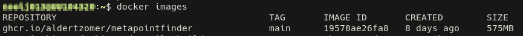
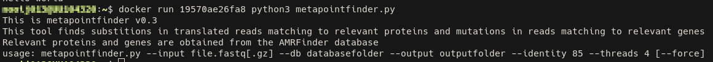

# MetaPointFinder

 [](https://klif.uu.nl/metapointfinder)

[](https://github.com/psf/black)

**MetaPointFinder** is a tool for detecting and scoring resistance-associated point mutations directly from long-read and short-read metagenomics sequencing data, using the AMRFinder database as reference.

A user-friendly **web interface** is available at [klif.uu.nl/metapointfinder](https://klif.uu.nl/metapointfinder).

---

## Features

- Detects amino acid substitutions in translated reads using DIAMOND and AMRFinder protein mutation databases.
- Detects nucleotide mutations using KMA against AMRFinder DNA databases.
- Scores mutations using MSA-based alignment and outputs both read-level classifications and summary tables.
- Supports direct analysis of metagenomic datasets (nanopore or Illumina fastq files).

---

## Installation

### Conda/mamba

The simplest installation methods are Mamba and Docker. These are therefore
recommended. Both methods include MetaPointFinder itself along with all its
[dependencies](#dependencies)).

To install Mamba, see
[its documentation](https://mamba.readthedocs.io/en/latest/installation/mamba-installation.html).

To install MetaPointFinder using mamba, type:

```bash
mamba create -n metapointfinder -c conda-forge -c bioconda metapointfinder
```

or with conda

```bash
conda create -n metapointfinder -c conda-forge -c bioconda metapointfinder
```

### Docker

To install Docker, see its [documentation](https://docs.docker.com/desktop/).
The Docker container of MetaPointFinder can be acquired through GitHub:

```bash
docker pull ghcr.io/aldertzomer/metapointfinder:main
```

(Also see the
[package page](https://github.com/aldertzomer/metapointfinder/pkgs/container/metapointfinder)
.)

### Dependencies

- **R** with libraries:
  - `Biostrings`
  - `pwalign`
  - `parallel`

- **DIAMOND**
- **KMA**
- **wget**

For your convenience, we have compiled a conda file that can install all
dependencies in one go:

```bash
git clone https://github.com/aldertzomer/metapointfinder.git
cd metapointfinder
mamba env create -f dependencies.yaml
```

**This practically installs MetaPointFinder for you.**
You can then run it as follows:

```bash
mamba activate metapointfinder
python3 metapointfinder.py --help
```

(However, this will only work when 'metapointfinder' is your current
working directory. It is not automatically linked to your environment
($PATH).)

R packages can be installed separately with:

```r
install.packages("parallel")
install.packages("BiocManager")
BiocManager::install(c("pwalign", "Biostrings"))
```

DIAMOND can be downloaded from:
<https://github.com/bbuchfink/diamond/releases/>

KMA can be obtained from:
<https://bitbucket.org/genomicepidemiology/kma>

### Operating system compatibility

MetaPointFinder has been tested on Linux only, specifically on:

- Red Hat Enterprise Linux (RHEL) version 9.5
- Fedora version 43
- Alpine Linux v3.22 (as Docker container)

It is expected to work on any GNU/Linux system and possibly other nix-like
systems. The Docker container should work on any platform.

---

## Usage

```bash
metapointfinder.py --input file.fastq[.gz] --db databasefolder --output outputfolder --identity 85 --threads 4 [--force]
```

When using the Docker container, you can use these commands to get started:

First, check the ID of the image, for example:

```bash
docker images
```



Then run the image that is listed as `ghcr.io/aldertzomer/metapointfinder`
like so, where you fill in the ID that was returned by the previous command:

```bash
docker run [fill in your ID here!] python3 metapointfinder.py
```



Finally, to run the actual program using FASTQ files in your current directory,
run:

```bash
docker run -v $(pwd):/workdir:z [fill in your ID here!] python3 metapointfinder.py\
 --input /workdir/[example].fastq.gz --output /workdir/output\
 --db /workdir/metapointfinder_database --identity 85 --threads 4
```

Make sure to fill in the right paths to your FASTQ file, desired output
directory and database folder!

### Arguments

- `--help`: Print the [usage](#usage)
- `--version`: Shows the program version
- `file.fastq` or `file.fastq.gz`: sequence read data file. Currently paired read data information is not used.
- `databasefolder`: Directory where AMRFinder databases will be downloaded/prepared.
- `output_folder`: Directory to store all results.
- `--identity 85`: percentage identity cutoff. Results may vary with different cutoffs
- `--threads 4` : parallel processing in diamond, kma and calling pwalign in parallel using mcapply in R
- `--force`: write in same directory and overwrite results. Use with care. Never use in parallel with different input files.

> If `databasefolder` does not exist, it will be created automatically and the required AMRFinder databases will be downloaded and processed.

---

## Pipeline Overview

1. **Database Preparation:**
   - AMRFinder protein and DNA reference databases are downloaded.
   - Mutation tables are preprocessed for scoring.
   - DIAMOND and KMA databases are created.

2. **Read Processing:**
   - Reads aligned to AMR proteins using DIAMOND blastx.
   - Reads aligned to AMR genes using KMA.
   - Matching regions extracted and scored using the provided R scripts.

3. **Mutation Scoring (in R):**
   - Translated protein reads and DNA reads are aligned to references using ClustalW (via the `pwalign` R package).
   - Known mutations from AMRFinder mutation tables are searched for.
   - Each read is scored:
     - **MutationScore:** Number of known resistance mutations detected.
     - **DetectedMutations:** List of mutations found (or "None").
     - **WTConfirmedPositions:** Number of WT positions detected.
     - **Status:** Scoring of read as Wildtype (WT), Resistant (R) or Unknown (UNKNOWN)

4. **Results Aggregation:**
   - WT, R and UNKNOWN counts summarized by antibiotic class and gene.

---

## Output Files

| File                                               | Description                                                     |
|----------------------------------------------------|-----------------------------------------------------------------|
| `*.prot.updated_table_with_scores_and_mutations.tsv` | Read-level protein mutation classification (WT/R/UNKNOWN).    |
| `*.dna.updated_table_with_scores_and_mutations.tsv`  | Read-level DNA mutation classification (WT/R/UNKNOWN).        |
| `*.class.prot.summary.txt`                           | WT/R summary per antibiotic class (protein level).              |
| `*.gene.prot.summary.txt`                            | WT/R summary per gene (protein level).                          |
| `*.class.dna.summary.txt`                            | WT/R summary per antibiotic class (DNA level).                  |
| `*.gene.dna.summary.txt`                             | WT/R summary per gene (DNA level).                              |
| Log and error files                                  | Detailed logs for troubleshooting DIAMOND, KMA, and R execution.|

---

## Example Output (Class Summary)

Example (`*.class.prot.summary.txt`):

```console
class           WT    R     UNKNOWN
BETA-LACTAM     255   44    2003
COLISTIN        59    12    2938
QUINOLONE       185   25    3209
MULTIDRUG       134   33    2635
```

---

## Example Output (Read Classification)

Example (`*.prot.updated_table_with_scores_and_mutations.tsv`):

| class        | gene                                              | read                                   | reference | target | changes_str            | MutationScore | DetectedMutations  | WTConfirmedPositions | Status |
|--------------|---------------------------------------------------|----------------------------------------|-----------|--------|------------------------|---------------|--------------------|----------------------|--------|
| BETA-LACTAM  | two-component_system_sensor_histidine_kinase_BaeS | 10478f68-f181-4626-976f-93d14c49844b   | ...       | ...    | Y42H,T175P,R153P       | 0             | None               | 3                    | WT     |
| COLISTIN     | two-component_system_sensor_histidine_kinase_PmrB | 1249bd62-efe5-46d5-96c4-1e903c85dec5   | ...       | ...    | V161G,T92P             | 1             | V161G              | 2                    | R      |
| ...          | ...                                               | ...                                    | ...       | ...    | ...                    | ...           | ...                | ...                  |        |

- **class:** Antibiotic class.
- **gene:** Gene or protein name.
- **read:** Read identifier.
- **reference:** Reference sequence used for alignment.
- **target:** Sequence from read.
- **changes_str:** List of expected mutations.
- **MutationScore:** Number of detected resistance mutations.
- **DetectedMutations:** Mutations actually found in the read.
- **WTConfirmedPositions:** Number of WT positions detected.
- **Status:** Scoring of read as Wildtype (WT), Resistant (R) or Unknown (UNKNOWN)

---

## Notes

- Databases are downloaded directly from NCBI during the first run.
- Mutation detection relies on known mutations in the AMRFinder database. Novel mutations will not be scored.
- For metagenomic samples with highly fragmented reads, alignment quality may affect detection sensitivity.
- There is a correlation between fragmentation and number of reads scored as WT and UNKNOWN.

---

## License

This tool is released under the [Apache-2.0 License](LICENSE).

---

## Citation

If you use MetaPointFinder in your work, please cite:

> Zomer, A.L. *et al.* MetaPointFinder: a tool to detect resistance mutations directly from long-read metagenomic data using AMRFinder databases. [GitHub Repository](https://github.com/aldertzomer/metapointfinder)
